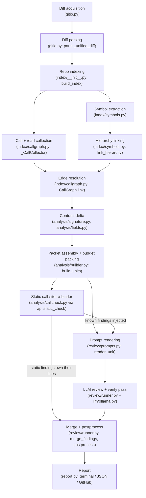
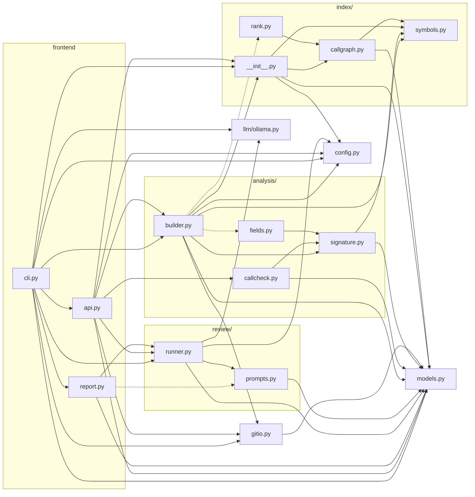

# bugwrap architecture

bugwrap is a code-review tool for Python repositories that replaces "hand the model a
raw git diff" with **Smart Context**: it parses the whole repo with `ast`, builds an
import-, type-, and hierarchy-aware call graph, classifies each change as a local edit
or a *contract change*, and assembles one budget-packed "impact packet" per changed
symbol — the diff, the symbol's full body, and the exact call sites the change can
break. A deterministic static layer re-binds every known call site against the changed
signature the way CPython would and emits provable findings for free; a local LLM (via
Ollama) then reviews each packet for everything that is *not* provable, is told what
the static layer already found, and must defend every finding against an adversarial
verify pass. The design goal throughout is precision over recall: a false call site or
a hallucinated finding costs more than a missed one, so every heuristic is gated on
evidence and everything unprovable is dropped or delegated rather than guessed.

---

## Pipeline overview



Two entry paths drive this pipeline:

- `bugwrap review` (`cli.py: cmd_review`) runs everything.
- `bugwrap check` (`cli.py: cmd_check`) stops after the static re-binder — no model,
  no tokens.
- `bugwrap context` (`cli.py: cmd_context`) stops after packet assembly and shows what
  *would* be sent.
- The programmatic equivalents live in `api.py` (`context_for`, `static_check`,
  `review_changes`).

## Module dependency graph

Arrows point from importer to imported. Dashed arrows are lazy (function-local)
imports.



`models.py` and `config.py` are the leaves: pure dataclasses, no internal imports.
`llm/ollama.py` is stdlib-only and imports nothing from the package.

---

## Layer by layer

Every layer is achieved with the Python standard library or a CLI the developer
already has — that is the zero-dependency contract. At a glance:

| # | Layer | Achieved with |
|---|---|---|
| 1 | Diff acquisition & parsing | `git` CLI via `subprocess`, `gh` CLI (PRs), `re` (hunk headers), hand-written unified-diff parser |
| 2 | Symbol extraction | stdlib `ast` — `ast.parse`, `ast.NodeVisitor`, `ast.unparse`, `end_lineno` spans |
| 3 | Call graph | stdlib `ast` (one `NodeVisitor` pass), `builtins` (guard list), plain `dict` indexes |
| 4 | Class hierarchy | stdlib `ast` (`ClassDef.bases`), BFS over `dict` adjacency, depth-capped |
| 5 | Contract deltas | stdlib `ast` — node diffing with `ast.unparse`, `ast.Raise`/`Return`/`Yield` walks |
| 6 | Field contracts | stdlib `ast` — class-body `Assign`/`AnnAssign` + `self.x` target walk |
| 7 | Packet builder | pure Python ranking + packing; `git log` (co-change); power-iteration PageRank |
| 8 | Static re-binder | stdlib `ast` + a hand-written CPython-faithful argument binder; `functools.lru_cache` |
| 9 | LLM layer | `urllib.request` → Ollama REST (`/api/chat`, JSON-Schema `format`); `concurrent.futures` |
| 10 | Merge & reporting | `json`, `textwrap`, raw ANSI codes, `gh` CLI; config via `tomllib` |

Not used anywhere: tree-sitter, LSP servers, Jedi/Pyright, networkx, requests,
pydantic. Each was considered and rejected — the reasons live in
[RESEARCH.md](RESEARCH.md).

### 1. Diff acquisition and parsing — `gitio.py`

**Purpose.** Everything the tool knows about "what changed" enters here: working-tree
diff (`diff_working`), merge-base diff against a branch (`diff_base`), commit range
(`diff_range`, with `...` merge-base semantics), GitHub PR via `gh` (`diff_pr`), and a
synthetic "whole-file" mode (`synthesize_full_review`) that fabricates a `FileDiff`
with status `"F"` and every line marked touched. `co_change_counts` mines the last 400
commits for files that historically ship together (commits touching 2–30 `.py` files
only — larger sweeps carry no signal).

**Built with.** the `git` CLI driven through `subprocess.run` (`diff`, `show`, `merge-base`, `log --name-only`, `rev-parse`), the `gh` CLI for PR diffs and metadata, and one `re` pattern (`HUNK_RE`) for `@@` hunk headers. The unified-diff parser itself is ~90 lines of hand-written Python — no `difflib`, no external diff library — because it must track old- and new-side line numbers per hunk, which `difflib` does not expose.

**Key data structures.** `Hunk` and `FileDiff` (`models.py`). `FileDiff.new_lines` /
`old_lines` are the line-precise sets everything downstream keys off. Statuses:
`A` added, `M` modified, `D` deleted, `R` renamed, `F` full-file review.

**Precision rules.** Diffs are taken with `--no-color --no-ext-diff -U3
--find-renames`. The parser (`parse_unified_diff`) tracks both old- and new-side line
numbers per hunk, handles renames, binary markers, quoted paths, and `\ No newline`.
A pure deletion (no `+++` path) falls back to the old path.

**Failure modes / non-goals.** The parser trusts git's output; it does not validate
hunk arithmetic. PR mode falls back to base `"HEAD"` if `gh pr view` fails, which can
make the "old source" lookup wrong for PR diffs on out-of-date checkouts.

### 2. Symbol extraction — `index/symbols.py`

**Purpose.** One `ast.parse` per file; `_Collector` records every function, method,
and class as a `Symbol` with a line-precise span. This is the substrate for
line→symbol ownership, signature diffing, and snippet slicing.

**Built with.** the stdlib `ast` module, exclusively: `ast.parse` (one parse per file, shared with the call collector), an `ast.NodeVisitor` subclass over `FunctionDef`/`AsyncFunctionDef`/`ClassDef`, `node.end_lineno` for exact spans, `node.decorator_list[0].lineno` for slice starts, and `ast.unparse` to produce normalized signature text (`def f(a, b=1) -> int`). This is why bugwrap is Python-3.11+-only and dependency-free: CPython's own parser is the ground truth, which tree-sitter or regex approaches can only approximate.

**Key data structures.** `Symbol` (`models.py`): `module`, `qualname`
(`Class.method`), `kind` (`function|method|class`), `lineno` (the `def` line),
`start_lineno` (first decorator line — source slices start here), `end_lineno`,
normalized `signature` text, `decorators`, `bases`. `SymbolTable` indexes symbols four
ways: `by_fq`, `by_short`, `by_path`, `modules`.

**Precision rules.**
- `enclosing(path, line)` picks the smallest containing span, preferring a callable
  over its class on a tie; `owning_function` restricts to callables. This is what maps
  a touched diff line to "the function that owns it".
- `module_name` derives the dotted module by walking parent directories while
  `__init__.py` exists, so `src/`-layout packages resolve correctly with no
  configuration.
- Unparsable files (`SyntaxError`) yield zero symbols and are recorded in
  `RepoIndex.skipped` rather than crashing the run.

**Non-goals.** No lambdas, no comprehension scopes, no symbols assigned dynamically
(`Foo = make_class()`). `SymbolTable.resolve` exists but is currently unused (the call
graph does its own resolution).

### 3. Call graph — `index/callgraph.py`

**Purpose.** The reverse index "who calls what". `_CallCollector` walks each file's
AST once, recording every call with a best-effort target fqname and a **resolution
quality** tag; `CallGraph.link()` binds those edges to real symbols in a second pass
after all files are indexed.

**Built with.** the same single `ast` pass (`_CallCollector`, an `ast.NodeVisitor` over `Call`, `Attribute`, `Import`, `ImportFrom`, `Assign`, `AnnAssign`), the stdlib `builtins` module (`dir(builtins)` feeds the builtin guard), and `dataclasses.replace` for per-candidate edge copies. The graph itself is plain dictionaries (`_callers`, `_callees`, `_by_name`, `_readers`) — no networkx, no graph library; the operations needed are exact-key lookups, which `dict` already does optimally. Persistence is the mtime+size-keyed JSON cache in `index/__init__.py` (`json` + `dataclasses.asdict`).

**Key data structures.** `CallSite` (`models.py`) — path, line, caller fqname, target
fqname, raw dotted text, `resolution`, source line text. `CallGraph` holds forward
(`_callees`), reverse (`_callers`), name (`_by_name`), and attribute-read
(`_readers`) indexes, plus per-file import sets.

**Resolution, in order of attempt (`_CallCollector._resolve`):**
1. `self.x()` / `cls.x()` → the enclosing class → `self`.
2. Receiver with a proven local type (`cart = Cart()`, `cart: Cart`, annotated
   param) → `typed`. Type binding is flow-insensitive, one dict per lexical scope,
   and gated on the **CapWords heuristic** (`_class_fq`: the name's last segment must
   start uppercase, so `factory()` never binds a type).
3. Bare imported name → `import`; dotted name through the longest matching import
   prefix → `module`.
4. Top-level name defined in the same file → `local`.
5. Otherwise: dotted calls stay `attr` (untyped receiver), bare calls stay `name`.

**Link-time precision rules (`link` / `_fallback` / `_has_evidence`):**
- **Builtin guard.** A `name`-resolution call to anything in `dir(builtins)` is
  dropped, never name-matched.
- **Protocol-method guard.** `attr`/`typed` calls to `_PROTOCOL_METHODS`
  (`get/append/read/close/…`) on an unresolvable target are dropped — every container
  implements them, so the name proves nothing. (A `typed` edge that resolves via
  `by_fq` never reaches this guard; the guard only applies in the fallback.)
- **The evidence rule.** A short-name fallback match counts only if the candidate is
  in the same file **or** the calling file imports the candidate's module (or a name
  from it). Deliberately not the reverse: `import re` is no evidence of a call into
  `re._parser` — treating it as such cost ~900 phantom call sites on the stdlib.
- **Dotted-tail evidence.** `Cart.total` matching `shop.cart.Cart.total` on a dot
  boundary is accepted; a bare tail match is not (otherwise `anything.get` tail-matches
  every module-level `get`).
- **AMBIGUOUS_FANOUT (= 3).** If 2–3 evidence-backed candidates remain, the edge is
  attributed to *each* with resolution downgraded to `ambiguous` (confidence 0.35) so
  ranking sinks it; beyond 3, the edge is discarded and counted in `too_ambiguous`.
- **Inherited binding (`_inherited`).** `pkg.mod.Derived.method` where `Derived`
  inherits `method` binds the edge to the base class's definition.

The graph also indexes **attribute reads** (`visit_Attribute`) — but only on `self`/
`cls` or typed receivers — which is what lets a removed dataclass field find its
readers (`readers_of`), and a **name index** over every edge regardless of resolution
(`by_name`), which is what finds callers of a *deleted* symbol that no longer exists
to resolve against.

**Failure modes / non-goals.** No data flow, no MRO beyond simple base walking, no
`getattr` / dynamic dispatch, no cross-repo resolution. Star imports are skipped.
Ambiguous fallback edges are appended to `_callers` but their `target` field is left
as the raw unresolved string.

### 4. Class hierarchy — `index/symbols.py` (`link_hierarchy`, `resolve_method`, `overrides_of`)

**Purpose.** Resolve raw base-class names into edges so that (a) calls through
subclasses bind to the base method they actually reach, (b) a parent signature change
lists and checks every override, and (c) field removal walks subclasses.

**Built with.** `ast.unparse` over `ClassDef.bases` at collection time (stored as raw strings on `Symbol.bases`), then pure-Python resolution at link time: dict lookups under the evidence rule, and breadth-first walks over two adjacency dicts (`bases_of`, `subclasses_of`) with a depth cap of 8 and a seen-set. No MRO library, no `inspect` — the repo's classes are never imported or executed.

**Precision rules.** Base resolution uses the same evidence rule as the call resolver
(same module, or the file imports the base's module) and requires a *unique* match.
Well-known external bases (`object`, `Exception`, `ABC`, `Protocol`, `Enum`,
`Generic`, `NamedTuple`, `TypedDict`, `BaseModel`) are excluded — no edges to draw.
`resolve_method` walks upward with a depth cap of 8 (cycles/deep towers).
`overrides_of` walks `subclasses_of` transitively with a seen-set.

**Non-goals.** No multiple-inheritance MRO ordering (bases are tried in declaration
order), no metaclasses, no `__getattr__` forwarding.

### 5. Contract deltas — `analysis/signature.py`

**Purpose.** Decide whether an edit is a local concern (body-only) or a **contract
change** whose blast radius is every call site. `analyze_symbol` locates the def in
the old and new source (`find_node`, by dotted qualname) and `compare` diffs them.

**Built with.** stdlib `ast` on both revisions: `find_node` walks the tree by dotted qualname, `params_of` reads `node.args` (posonly/args/vararg/kwonly/kwarg) with `ast.unparse` for annotations and defaults, and `behavior_delta` walks the function's own body for `ast.Raise`, `ast.Return`, `ast.Yield`/`YieldFrom` nodes. The old source comes from `git show <rev>:<path>` (`gitio.show_file`) — no second checkout needed.

**Key data structures.** `Param` (name, kind `posonly|arg|vararg|kwonly|kwarg`,
annotation, default) and `SignatureDelta` (`models.py`): `kind`
(`added|removed|signature_changed|body_only|full_review`), `breaking`, `details`,
old/new signature text, and `behavior` notes. `SignatureDelta.is_contract_change` is
true for `signature_changed`, `removed`, breaking `added`, or any behaviour note.

**What counts as breaking:** parameter removed; REQUIRED parameter added; param kind
changed; default removed; positional order changed; sync↔async; a decorator change
touching `property`/`staticmethod`/`classmethod`/`cached_property`; function↔generator
toggle. Annotation and return-type changes are reported but not breaking.

**Behaviour contract (`behavior_delta`)** covers what callers feel even when the
signature text is unchanged: raise-set delta (exception names from `ast.Raise` in the
function's *own* body — `_own_body` deliberately does not descend into nested
defs/classes), coarse return shapes (`None`, `tuple[n]`, `dict`, `list`, `value`;
falling off the end is implicit `None`), and the generator toggle.

**Non-goals.** No type inference — annotations are compared as text. Exceptions
raised by callees, re-raises without an expression, and `raise` through helper
functions are invisible. Return-shape detection is syntactic only.

### 6. Field contracts — `analysis/fields.py`

**Purpose.** A removed dataclass field or `self.x = ...` assignment breaks every
`obj.x` reader — invisible to signature diffing. `class_fields` collects class-level
assignments (annotated or plain) plus `self.x` assignments anywhere in the class's own
methods; `removed_fields` compares base vs new.

**Built with.** stdlib `ast` again: class-body `AnnAssign`/`Assign` targets for declared fields, `ast.walk` over the class's own methods for `self.<name>` assignment targets (`Assign`/`AnnAssign`/`AugAssign` with an `ast.Attribute` target whose value is `Name('self')`), and set arithmetic between the base and new revisions.

**Precision rule (the property-shim rule).** A name is only "removed" if it survives
as *nothing* — `_exposed_names` includes fields **and** method names, so a field
renamed behind a `@property` or turned into a method is not a false positive:
`obj.x` still answers.

**Non-goals.** Fields set outside the class body (monkey-patching, mixin `__init__`
chains) and `setattr` are invisible. A class that was added or removed entirely is
handled by other paths and returns `[]` here.

### 7. Packet assembly and budget packing — `analysis/builder.py`

**Purpose.** Turn diffs + index into `ChangeUnit`s — one self-contained review packet
per changed symbol.

**Built with.** pure Python over the index: ranking and packing are arithmetic on dataclasses; snippets are string slicing over cached file text; co-change mining is one `git log --name-only` call (`gitio.co_change_counts`); PageRank (`index/rank.py`) is ~40 lines of power iteration over the resolved-edge dict — damping, dangling-mass redistribution, 25 iterations — no numpy, because the stdlib is fast enough (0.2s over 12k stdlib nodes). Token estimation is `len(text)/3.3` — deliberately a heuristic, since the guardrail is Ollama's `truncated` flag, not estimator precision.

**Key data structures.** `ChangeUnit` and `ImpactSite` (`models.py`). An `ImpactSite`
carries the call site, a line-numbered snippet (± `snippet_radius` lines, `>` marker
on the call line), the enclosing function's signature, an `is_test` flag, and `hop`/
`via` for two-hop sites.

**Unit kinds produced by `build_units`:**
- **Symbol unit** (`_symbol_unit`) — a touched function/method/class, with its delta,
  the overlapping diff hunks, the full line-numbered body, the old body on contract
  changes, callers, callees, and overrides.
- **Removed-symbol unit** (`_removed_unit`) — a def that existed at base and is gone,
  found by re-extracting symbols from the old source; callers come from the *name
  index* (`by_name`) since there is nothing left to resolve against, and the packet
  carries an explicit caveat note about name-only resolution.
- **Field unit** (`_field_units`) — one per class that lost data attributes; callers
  are the attribute *readers* (hierarchy-wide, minus reads inside the class itself).
- **Module unit** (`_module_unit`) — touched lines no symbol owns (imports, constants,
  top-level code), with a numbered window of up to 60 lines.
- **Deleted-file unit** (`_deleted_file_unit`) — whole file gone; lists lost top-level
  signatures and name-index callers.

**Ranking.** Units are ordered by `_unit_priority`: breaking first, then contract
change, then caller count, then diff size. Whole-file audits (all statuses `"F"`)
instead sort by **PageRank centrality** (`index/rank.py`: plain power iteration,
damping 0.85, 25 iterations, dangling mass redistributed) — with a fixed budget,
review the load-bearing symbols first. Impact sites are ranked by `_site_score`:
resolution confidence + 0.3 for cross-file (cross-file impact is the whole point),
tests +0.15 on contract changes / −0.1 otherwise.

**Two-hop impact.** For breaking contract changes only, if a caller's enclosing
function has `*`/`**` in its signature (a forwarding wrapper hides the real
arguments), the wrapper's own callers are pulled in, capped at `max_callers + 4`
total, tagged `hop=2` / `via=<wrapper>`.

**Co-change notes** (`_note_co_changes`). On contract changes, files that co-committed
with this one in ≥3 commits and ≥40% of its max co-change count — but are untouched in
this diff — are surfaced as a packet note.

**Budget packing (`_pack`).** `estimate_tokens` is deliberately pessimistic
(3 chars/token). The budget is `Config.unit_budget` — ~65% of `num_ctx`, leaving
~35% for the system prompt, chat overhead, and output. Drop order, cheapest signal
first: callees → worst-ranked callers (already sorted best-first) → the old source →
finally truncate the new source. Each sacrifice that changes meaning appends a
visible note to the packet.

**Non-goals.** The packet does not include whole files, does not follow more than two
hops, and never invents call sites: every impact site came from the graph under the
evidence rule.

### 8. Static call-site re-binder — `analysis/callcheck.py` (driven by `api.static_check`)

**Purpose.** The deterministic layer under the LLM — bugwrap's version of the
linter/SAST layer that gives commercial reviewers their precision. When a signature
changed, re-bind every known call site against the new signature exactly the way
CPython would, and report only what provably no longer binds.

**Built with.** stdlib `ast` to locate the exact `ast.Call` node at each site (`functools.lru_cache`-cached parses, keyed by source text — never by `id()`), plus `bind_call`: a hand-written re-implementation of CPython's argument-binding rules (positional fill, keyword matching, posonly/kwonly constraints, vararg/kwarg widening) over our `Param` model. Python's own `inspect.Signature.bind` is *not* used because it would require importing the target module — executing repo code — whereas this binder works from the AST alone.

**Crucially, it does not run on the packed packet.** `api.static_check` rebuilds each
unit's caller list from the *full* graph (`callers_of` / `by_name`), uncapped —
packing exists for the model's context window; this check is free.

**Checks and confidences:**

| Check | Gate | Severity / confidence |
|---|---|---|
| Call to removed symbol (`_check_removed`) | resolution ∈ {import, module, self, local} — only these prove the call bound to *this* symbol | critical / 0.95 |
| Call no longer binds (`_check_signature` + `bind_call`) | provable binding failure, one finding per call site | high / 0.95 |
| Newly-async call not awaited (`_is_awaited`) | direct `await`, or being an argument to another call (`asyncio.run(f())` etc.) counts as consumed | high / 0.9 |
| Read of removed field (`_check_removed_fields`) | resolution ∈ {self, typed} | high / 0.9 |
| Override diverges from changed parent (`_check_overrides`) | skipped if parent *or* override has `*args`/`**kwargs` | high / 0.85 |

**`bind_call` mirrors CPython:** too many positionals, unexpected keyword, keyword
targeting a positional-only param, missing required argument, duplicate
positional+keyword. It is conservative by construction: any `*args`/`**kwargs` at the
call site suppresses the checks it widens; missing-required is only checked with no
unpacking at all; bound-method calls strip `self`/`cls` only when the call is an
attribute call or `self`-resolved; direct unbound uses are skipped entirely.
Symbols decorated with signature rewrappers (`contextmanager`, `lru_cache`,
`singledispatch`, `pytest.fixture`, `click.*`, …, matched by prefix) are never
bind-checked — the def's params are not the callable's params. Two-hop sites are never
bind-checked (they call the wrapper, not the changed symbol).

**Non-goals.** Nothing type-level, nothing about argument *values*, no keyword-through-
dict tracking. When it cannot prove, it says nothing — that silence is what the bench's
control scenarios verify.

### 9. LLM layer — `review/prompts.py`, `review/runner.py`, `llm/ollama.py`

**Purpose.** Review each packet for what the static layer cannot prove: logic errors,
None-paths, behaviour changes, security. Written for local 7B–32B coder models: short
instructions, hard constraints, an explicit "empty findings is a good answer" escape
hatch, and JSON-Schema-constrained output (Ollama's `format` parameter) so parsing
needs no regex archaeology (though `_load_json` still recovers objects wrapped in
prose or fences by thinking models).

**Built with.** stdlib `urllib.request` speaking Ollama's REST API (`POST /api/chat` with `format=<JSON Schema>` for constrained decoding, `/api/tags`, `/api/show`) — no `requests`, no `httpx`, no `ollama-python`; `concurrent.futures.ThreadPoolExecutor` for `workers` parallel packets; `json` + one `re` pattern for fence-wrapped recovery. The whole client is ~150 lines, so another backend (an API model) is an afternoon, not a dependency decision.

**Flow (`review_units`):** a `ThreadPoolExecutor` (`workers`) maps packets to
`client.chat(SYSTEM, render_unit(unit, known), schema=FINDINGS_SCHEMA)`. Known static
findings for the unit's symbol are injected into the prompt under "ALREADY FLAGGED BY
STATIC ANALYSIS — do NOT repeat these". Responses are normalized by `parse_findings`
(missing file defaults to the unit's path, confidence clamped to [0,1]).

**Verify pass.** If `cfg.verify` (default on), every LLM finding is re-submitted with
`VERIFY_SYSTEM` — a skeptic whose *default position is that the report is wrong* — plus
the full packet (`render_verification`) and a boolean verdict schema. Refuted findings
are dropped; confirmed ones have confidence lowered to `min(original, verdict)` (a
zero/absent verdict confidence leaves the original). If verification itself errors,
the finding is kept — the pass can only be additive-negative. Static findings never go
through verify: they are proof-backed. On contract-bench this pass took static+3B from
54% to 100% precision.

**Ollama client (`llm/ollama.py`).** stdlib `urllib` only. Sets `num_ctx` explicitly
(Ollama defaults to 4096 and silently drops the *front* of an oversized prompt);
`ChatResult.truncated` flags `prompt_tokens >= num_ctx − 8` as the tell.
`model_context_length` reads the trained context from `/api/show` so the CLI can warn
and clamp.

### 10. Merge, postprocess, reporting — `review/runner.py`, `report.py`, `cli.py`

**Merge suppression (`merge_findings`).** Static findings own their lines: an LLM
finding within ±1 line of a static-covered `(file, line)` is the same issue reworded
and is dropped.

**Built with.** `json` for machine output, `textwrap` for terminal wrapping, hand-rolled ANSI escape codes honoring `NO_COLOR`/`FORCE_COLOR` (no rich/colorama), the `gh` CLI via `subprocess` for GitHub PR comments, and `tomllib` (stdlib since 3.11) for `.bugwrap.toml` — the reason the config format is TOML and the floor is Python 3.11.

**Postprocess (`postprocess`).** Confidence floor (`min_confidence`, default 0.45 —
local models over-report), dedupe on `(file, line, lowercased title)`, then sort by
severity desc, confidence desc, file, line. It runs twice on the review path: once
inside `review_units` over LLM findings, and again in `cmd_review` over the merged
static+LLM list.

**Reporting (`report.py`).** Terminal (colored, severity-badged, NO_COLOR/FORCE_COLOR
aware), JSON (`write_json` with summary + findings), packets-as-JSON for external
models (`units_json`, includes the rendered prompt), and a single GitHub PR comment
via `gh` (`post_to_github`). Exit codes: 0 clean, 1 findings at/above `fail_on`,
2 tool error.

---

## Anatomy of a packet

`render_unit` (`review/prompts.py`) renders a `ChangeUnit` into markdown-ish sections,
in this fixed order (sections absent when empty):

```
# FILE: shop/pricing.py
# SYMBOL: calculate_discount  (function, lines 1-2)

## CONTRACT CHANGE — the public signature changed        <- kind-dependent header:
before: def calculate_discount(price, pct)                  NEW DEFINITION / REMOVED /
after:  def calculate_discount(price, pct, currency)        FULL REVIEW / BODY-ONLY
  - REQUIRED parameter added: currency
  !! This is source-incompatible. Existing callers may now be wrong.

## BEHAVIOUR CONTRACT CHANGED                            <- only when delta.behavior
  - now raises: CurrencyError — callers may not catch these

## DIFF                                                  <- only hunks overlapping
```diff                                                     this symbol's lines
@@ -1,2 +1,2 @@
-def calculate_discount(price, pct):
+def calculate_discount(price, pct, currency):
```

## PREVIOUS VERSION                                      <- old body, contract
```python                                                   changes only; first to
def calculate_discount(price, pct):                         be elided by packing
    return price * (1 - pct)
```

## CURRENT SOURCE (line-numbered)                        <- full new body,
```python                                                   5-wide gutter
    1 | def calculate_discount(price, pct, currency):
    2 |     return price * (1 - pct)
```

## AFFECTED CALL SITES (2 of 5, 3 omitted)               <- best-resolved first,
### shop/order.py:6 inside def total(items, pct)            > marks the call line
```python
>    6 |     return calculate_discount(subtotal, pct)
```
### shop/api.py:14 [test] [2 hops — reaches the change through `shop.util.forward`]
...

## OVERRIDDEN BY (subclasses defining the same method)   <- methods only
- shop/eu.py:9  shop.eu.EuPricing.calculate: def calculate(self, price, pct)

## CALLS OUT TO                                          <- callee signatures,
- shop/fx.py:3  def rate(currency)                          budget filler, first
                                                            to be dropped
## NOTES
- Historically co-changed with this file but untouched in this diff: shop/order.py. ...

## ALREADY FLAGGED BY STATIC ANALYSIS — do NOT repeat these
- shop/order.py:6  `calculate_discount()` call no longer binds: is missing required
  argument `currency`
Report only issues NOT in the list above. If nothing else is wrong, return an empty
findings list.

Review the change above. Return JSON: {"findings": [...]}. Empty list if the change is sound.
```

When a symbol has no known callers, the AFFECTED CALL SITES section explicitly says so
("it may be a public entry point, called dynamically, or dead code") rather than being
omitted — absence of callers is itself review-relevant information.

---

## The resolution-quality ladder

Every call edge carries a `resolution` tag; `CallSite.confidence` (`models.py`) maps
it to a score the ranking and the static layer trust differently.

| Resolution | Confidence | Meaning | Static layer trusts it? |
|---|---|---|---|
| `import` | 1.00 | callee bound by name through an explicit import (`from x import f; f()`) | yes (removed-symbol check) |
| `module` | 0.95 | dotted call through an imported module path (`pkg.mod.f()`) | yes |
| `self` | 0.90 | `self.m()` / `cls.m()` through the enclosing class | yes (removed + field checks) |
| `typed` | 0.90 | receiver's class proven by a local binding or annotation (`cart = Cart(); cart.add()`) | field checks only |
| `local` | 0.85 | bare call to a top-level def in the same file | yes (removed-symbol check) |
| `name` | 0.60 | bare-name fallback match under the evidence rule | no |
| `attr` | 0.55 | unique method-name match on an untyped receiver | no |
| `ambiguous` | 0.35 | 2–3 plausible same-named candidates; attributed to each | no |
| *(unknown)* | 0.30 | defensive default | no |

The ladder is used three ways: `_site_score` ranks impact sites for packing; `by_name`
orders deleted-symbol candidates best-first; and `callcheck.py` gates each
deterministic check on the subset of resolutions that *prove* the binding.

---

## How findings flow

```mermaid
sequenceDiagram
    participant B as builder.py
    participant S as static_check (api.py -> callcheck.py)
    participant P as render_unit (prompts.py)
    participant M as model (ollama.py)
    participant V as verify pass (runner.py)
    participant R as merge + postprocess

    B->>S: units (callers re-expanded to ALL graph sites, uncapped)
    S-->>P: static findings, grouped by symbol qualname
    Note over P: injected as "ALREADY FLAGGED — do NOT repeat"
    P->>M: system + packet, JSON-schema constrained
    M-->>V: parsed LLM findings
    loop each LLM finding
        V->>M: skeptic prompt + full packet + finding
        M-->>V: {real, confidence, reason}
        Note over V: refuted -> dropped; kept -> confidence = min(own, verdict)
    end
    V-->>R: surviving LLM findings (postprocessed once in review_units)
    S-->>R: static findings (never verified — proof-backed)
    Note over R: merge_findings: static owns its lines,<br/>LLM findings within ±1 line dropped
    Note over R: postprocess: confidence floor -> dedupe on<br/>(file, line, title) -> sort severity/confidence
    R->>R: exit 1 if any finding >= fail_on
```

The layering is the point: the static layer owns localization (which exact call site
breaks), the model layer owns judgment (is this logic right), the injection + merge
stops them from double-commenting the same line, and the verify pass makes the model
earn every finding it keeps. The contract-bench ablation (ROADMAP.md) shows each layer
paying rent: llm-only recall is 8%, naive merge precision is 54%, the full stack is
100/100 with a 3B model.

---

## Benchmarks and gates

`bench/scenarios.py` seeds contract bugs (and silence controls, where any finding is a
false positive) into small git repos; `bench/run.py` materializes each into a tmpdir,
runs the real pipeline, and scores Martian-style (golden `(file, line, keyword)`
triples, ±2 line tolerance, precision/recall). `bench/martian.py` adapts a local run
into the Martian code-review-benchmark's comment format for head-to-head scoring
against commercial tools. Every resolver-touching change must pass both ROADMAP gates:
contract-bench at 100% precision, and the stdlib sanity check (index CPython's stdlib;
the top-callers list must stay `re.compile`/`argparse.add_argument`-shaped).
